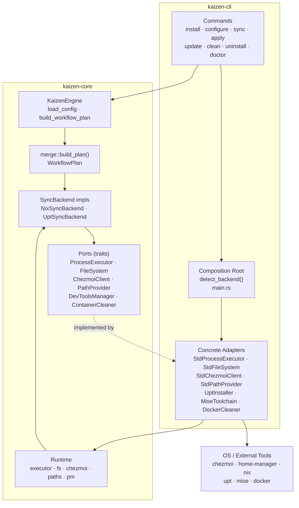
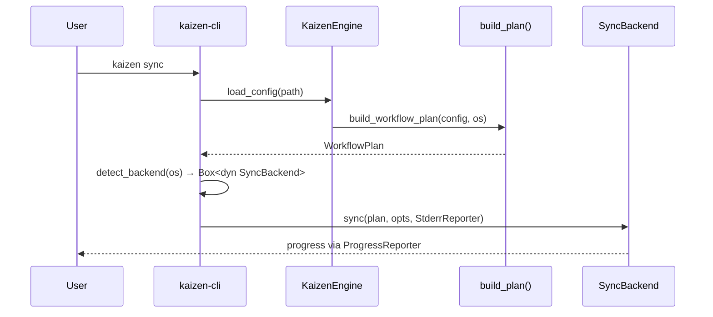
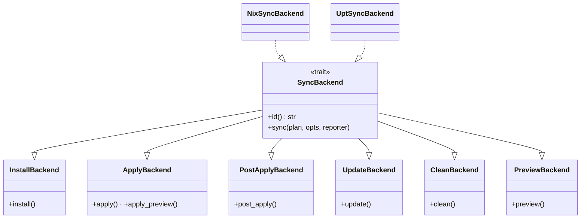
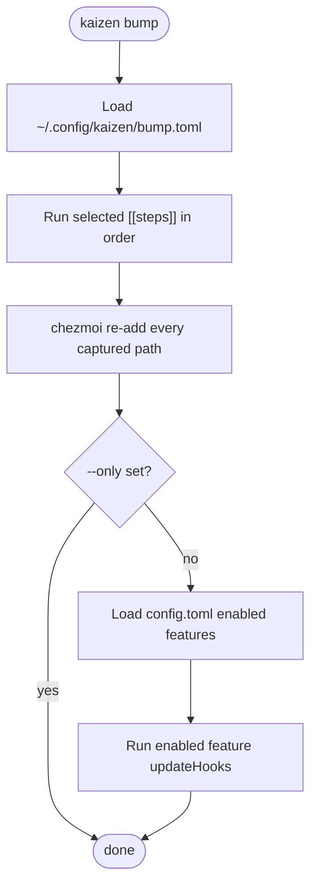
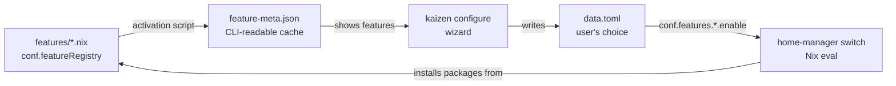
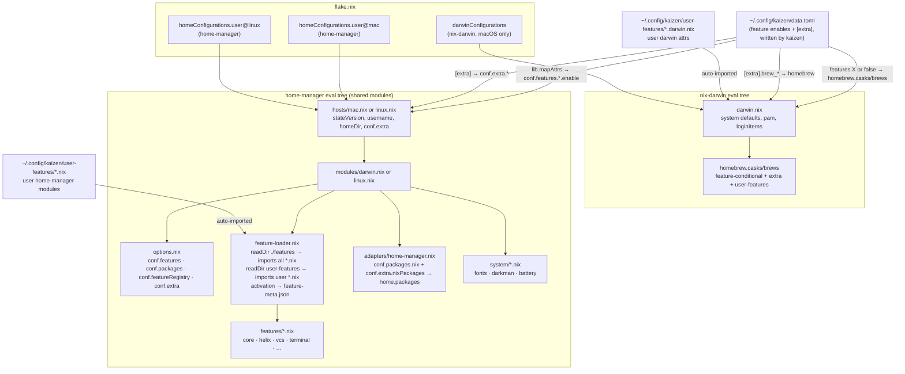

# Kaizen Architecture

Kaizen is a headless workflow orchestrator: manages dotfiles, packages, and dev tooling across macOS and Linux. Two-crate workspace — `kaizen-core` (pure library) and `kaizen-cli` (binary that wires concrete OS adapters).

## Layer Diagram



Core backends call ports (traits), never OS directly. All `which` / `std::process` calls are in CLI adapters. `TargetOs::detect()` is the single exception — it queries `os_info` in core for convenience.

## Composition Root

`backend.rs` in CLI constructs all concrete adapters and injects them:

```
detect_backend(os)
  └─ Runtime { StdProcessExecutor, StdFileSystem, StdChezmoiClient, StdPathProvider, pm }
  └─ NixSyncBackend(os, runtime, MiseToolchain, DockerCleaner)
  └─ UptSyncBackend(os, runtime, UptInstaller, MiseToolchain, DockerCleaner)
```

## Data Flow



`ProgressReporter` is injected by CLI (`StderrReporter`); core never prints directly.

## Backend Selection


Step order differs: Nix runs `chezmoi apply` first so `~/.config/kaizen/data.toml` is written before `home-manager switch` reads it.

## SyncBackend Trait Hierarchy



Each CLI command depends only on the narrowest sub-trait it needs.

## Command → Sub-trait Mapping

| Command     | Depends on                           |
| ----------- | ------------------------------------ |
| `sync`      | `SyncBackend` (full)                 |
| `apply`     | `ApplyBackend + PostApplyBackend`    |
| `update`    | `UpdateBackend`                      |
| `clean`     | `CleanBackend`                       |
| `install`   | CLI orchestration (configure → sync) |
| `configure` | `ChezmoiBootstrapper` + wizard       |

## kaizen bump

`kaizen bump` is the repository update command for lock files and tool caches.
It runs declarative manifest steps first, then runs enabled feature update hooks.



Manifest steps live in `bump.toml` and have three fields:

```toml
[[steps]]
name = "mise"
run = ["~/.config/scripts/mise-bump"]
capture = ["~/.config/mise.lock"]

[[steps]]
name = "nix"
run = ["nix", "flake", "update", "--flake", "~/.config/nix"]
capture = ["~/.config/nix/flake.lock"]
```

`name` is the stable selector used by `--only`. `run` is the command argv.
`capture` lists paths to run through `chezmoi re-add` after the command succeeds;
paths beginning with `~/` are expanded to the user's home directory.

The mise step calls `~/.config/scripts/mise-bump` instead of plain
`mise upgrade`. The script runs `mise upgrade --bump --interactive`, which opens
a checklist of tools with available updates. The user chooses what to bump each
time, so no hidden deny-list has to be maintained.

After mise updates the rendered `~/.config/mise.toml`, the script reads the
selected bumped versions, writes concrete versions back into the chezmoi template
`~/.local/share/chezmoi/dot_config/mise.toml.tmpl`, skips `latest` and `lts`
selectors, then runs `chezmoi apply` so the rendered config matches the updated
template. Exact pins such as `gopls = "0.20.0"` are bumped only when selected in
the interactive checklist.

After all manifest steps finish, `kaizen bump` loads the current config and runs
`updateHooks` from `conf.featureRegistry.<feature>` for enabled features only:

```nix
conf.featureRegistry.ai = {
  description = "AI coding agents and tooling";
  category = "ai";
  updateHooks = [
    { run = [ "pi" "update" "--extensions" ]; onFailure = "warn"; }
  ];
};
```

`onFailure = "warn"` prints a warning and continues with the next hook.
`onFailure = "fail"` prints an error and stops running further hooks. Hooks are
not run when any `--only <step>` filter is set, because that mode is scoped to
manifest steps.

`--dry-run` prints the manifest commands, `chezmoi re-add` captures, and feature
hook commands without executing them. `--only <step>` runs only matching
manifest steps by `name`; unknown names are an error, and feature hooks are
skipped whenever the filter is present.

## Feature Declaration and Package Flow

### The cycle

`features/*.nix` is the single source of truth. Everything flows from it and
returns to it.



`feature-meta.json` is a bridge — Rust cannot read `.nix` files, so
`home-manager` activation serialises `conf.featureRegistry` to JSON after
every switch. On a fresh machine (before the first switch) a committed seed
`dot_config/kaizen/feature-meta.json` is used instead and refreshed from the
cloned source on every `kaizen configure`.

### Nix evaluation trees

There are two separate Nix evaluation contexts, both reading `data.toml` as
their only shared runtime input.



### Feature module anatomy

Every `features/X.nix` follows this pattern:

```nix
# options.conf.features.X.enable  ←  set by data.toml at eval time

# config = lib.mkMerge [
#   { conf.featureRegistry.X = { description, category } }  ← always
#   (lib.mkIf cfg.enable {                                   ← when enabled
#     conf.packages.nix = [ ... ]                            ← → home.packages
#   })
# ]
```

`conf.featureRegistry` is always populated so `feature-meta.json` contains
the full feature list regardless of what is currently enabled.

### Feature metadata sources

Kaizen CLI priority when showing the wizard:

```
1. ~/.config/kaizen/feature-meta.json   ← live, written by HM activation on every switch
2. dot_config/kaizen/feature-meta.json  ← seed committed in dotfiles, refreshed on configure
```

## User Extensibility

Kaizen provides two escape hatches for user-specific customisation that survive
`kaizen configure` re-runs and dotfiles updates.

### `[extra]` in `config.toml`

For quick additions without writing Nix. Edit `~/.config/kaizen/config.toml`
manually after running the wizard. On the next `kaizen sync` the section is
propagated into `data.toml` (which Nix reads):

```
config.toml  →  kaizen sync (merge_kaizen_data_with)  →  data.toml  →  Nix eval
```

```toml
[extra]
nix_packages  = ["ripgrep", "bat"]         # top-level nixpkgs attribute names
brew_casks    = ["istat-menus"]            # homebrew casks (macOS)
brew_formulas = ["ffmpeg"]                # homebrew formulas (macOS)
brew_taps     = ["homebrew/cask-fonts"]   # homebrew taps (macOS)
```

`nix_packages` entries must be valid top-level `nixpkgs` attribute names
(e.g. `"nodejs_22"`, not `"nodePackages.prettier"`). An unknown name produces
a clear Nix eval error with the attribute name. The wizard never touches
`[extra]` — it is preserved verbatim across `kaizen configure` re-runs.

### `user-features/*.nix`

For users comfortable with Nix. Place modules in
`~/.config/kaizen/user-features/`. They are auto-discovered alongside built-in
feature modules and receive the same `{ config, lib, pkgs, ... }` arguments.

```
~/.config/kaizen/user-features/
  mytools.nix          ← home-manager module (packages, programs, dotfiles)
  mytools.darwin.nix   ← darwin attrs (darwinCasks, darwinActivationScripts, …)
```

`*.darwin.nix` files follow the same contract as built-in `*.darwin.nix`:
return an attrset with any combination of `darwinCasks`, `darwinBrews`,
`darwinTaps`, `darwinBrewFormulas`, `darwinActivationScripts`.

Both mechanisms require `home-manager switch` / `darwin-rebuild switch` to
take effect (`kaizen sync` triggers this automatically).

## WorkflowPlan

```
WorkflowPlan
├── install_plan  — OS packages + mise dev tools (empty on Nix — managed by Nix)
├── config_plan   — dotfiles backend ("chezmoi"), source URL, feature flags, settings
└── hook_plan     — post_install / post_apply / post_update shell commands
```

## Setup Flow

`kaizen install` / `kaizen configure` use `ChezmoiBootstrapper` (in core) for source-dir inspection, backup, and rollback — isolated from the main sync pipeline.

## Testing

All ports have no-op / in-memory implementations (`NoopExecutor`, `NoopChezmoiClient`, `MemFileSystem`). CLI commands expose `run_with(..., backend: &dyn SubTrait)` for injection — tests never spawn processes or touch disk.
