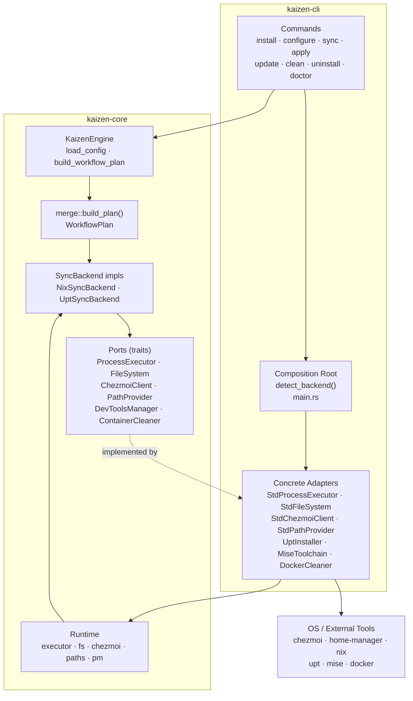
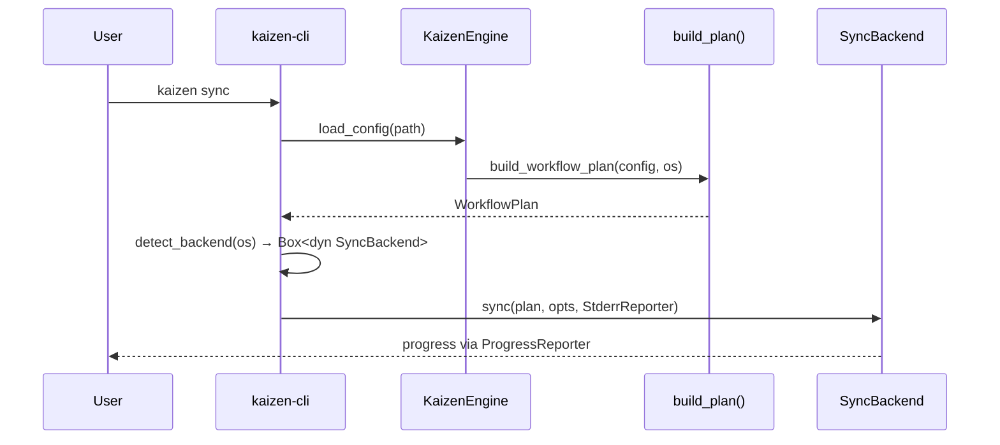
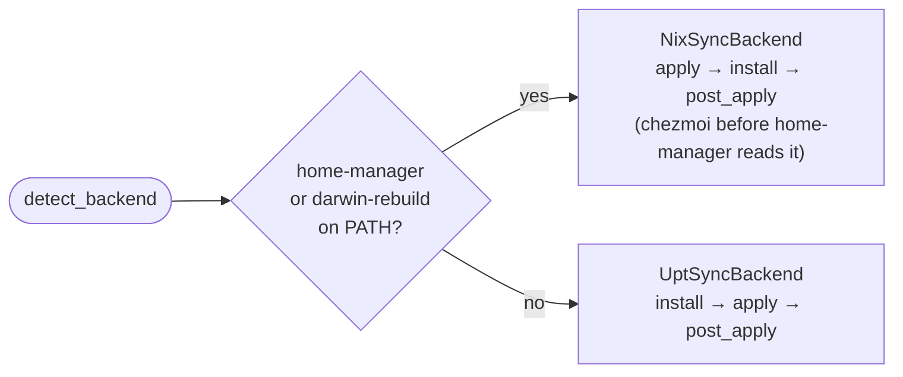
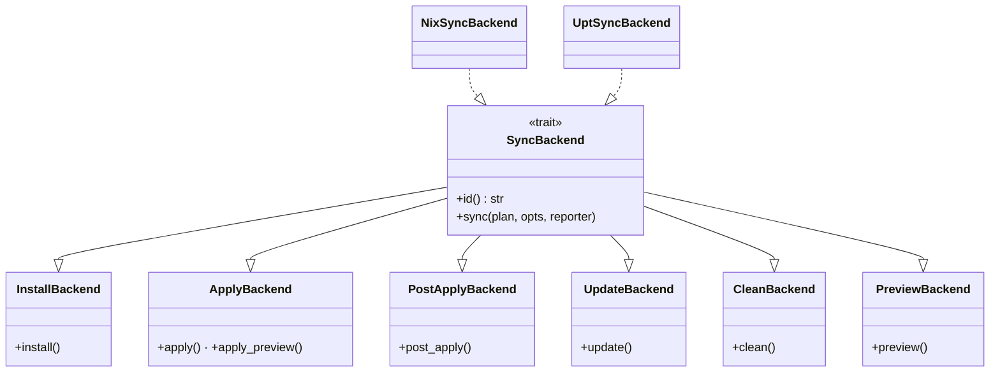
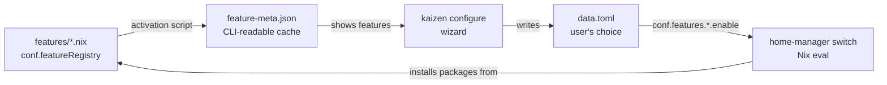
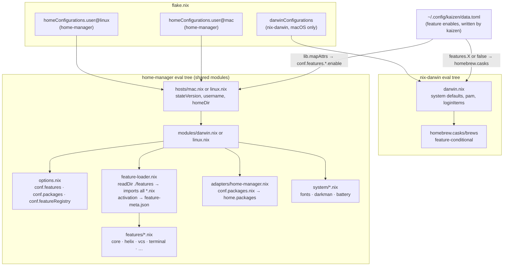

# Kaizen Architecture

Kaizen is a headless workflow orchestrator: manages dotfiles, packages, and dev tooling across macOS and Linux. Two-crate workspace — `kaizen-core` (pure library) and `kaizen-cli` (binary that wires concrete OS adapters).

## Layer Diagram



Core backends call ports (traits), never OS directly. All `which` / `std::process` calls are in CLI adapters. `TargetOs::detect()` is the single exception — it queries `os_info` in core for convenience.

## Composition Root

`backend.rs` in CLI constructs all concrete adapters and injects them:

```
detect_backend(os)
  └─ Runtime { StdProcessExecutor, StdFileSystem, StdChezmoiClient, StdPathProvider, pm }
  └─ NixSyncBackend(os, runtime, MiseToolchain, DockerCleaner)
  └─ UptSyncBackend(os, runtime, UptInstaller, MiseToolchain, DockerCleaner)
```

## Data Flow



`ProgressReporter` is injected by CLI (`StderrReporter`); core never prints directly.

## Backend Selection



Step order differs: Nix runs `chezmoi apply` first so `~/.config/kaizen/data.toml` is written before `home-manager switch` reads it.

## SyncBackend Trait Hierarchy



Each CLI command depends only on the narrowest sub-trait it needs.

## Command → Sub-trait Mapping

| Command     | Depends on                           |
| ----------- | ------------------------------------ |
| `sync`      | `SyncBackend` (full)                 |
| `apply`     | `ApplyBackend + PostApplyBackend`    |
| `update`    | `UpdateBackend`                      |
| `clean`     | `CleanBackend`                       |
| `install`   | CLI orchestration (configure → sync) |
| `configure` | `ChezmoiBootstrapper` + wizard       |

## Feature Declaration and Package Flow

### The cycle

`features/*.nix` is the single source of truth. Everything flows from it and
returns to it.



`feature-meta.json` is a bridge — Rust cannot read `.nix` files, so
`home-manager` activation serialises `conf.featureRegistry` to JSON after
every switch. On a fresh machine (before the first switch) a committed seed
`dot_config/kaizen/feature-meta.json` is used instead and refreshed from the
cloned source on every `kaizen configure`.

### Nix evaluation trees

There are two separate Nix evaluation contexts, both reading `data.toml` as
their only shared runtime input.



### Feature module anatomy

Every `features/X.nix` follows this pattern:

```nix
# options.conf.features.X.enable  ←  set by data.toml at eval time

# config = lib.mkMerge [
#   { conf.featureRegistry.X = { description, category } }  ← always
#   (lib.mkIf cfg.enable {                                   ← when enabled
#     conf.packages.nix = [ ... ]                            ← → home.packages
#   })
# ]
```

`conf.featureRegistry` is always populated so `feature-meta.json` contains
the full feature list regardless of what is currently enabled.

### Feature metadata sources

Kaizen CLI priority when showing the wizard:

```
1. ~/.config/kaizen/feature-meta.json   ← live, written by HM activation on every switch
2. dot_config/kaizen/feature-meta.json  ← seed committed in dotfiles, refreshed on configure
```

## WorkflowPlan

```
WorkflowPlan
├── install_plan  — OS packages + mise dev tools (empty on Nix — managed by Nix)
├── config_plan   — dotfiles backend ("chezmoi"), source URL, feature flags, settings
└── hook_plan     — post_install / post_apply / post_update shell commands
```

## Setup Flow

`kaizen install` / `kaizen configure` use `ChezmoiBootstrapper` (in core) for source-dir inspection, backup, and rollback — isolated from the main sync pipeline.

## Testing

All ports have no-op / in-memory implementations (`NoopExecutor`, `NoopChezmoiClient`, `MemFileSystem`). CLI commands expose `run_with(..., backend: &dyn SubTrait)` for injection — tests never spawn processes or touch disk.
