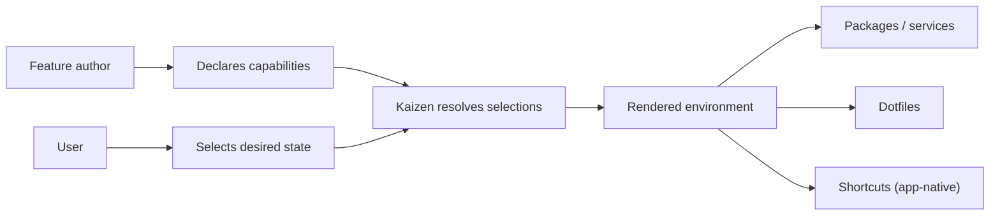
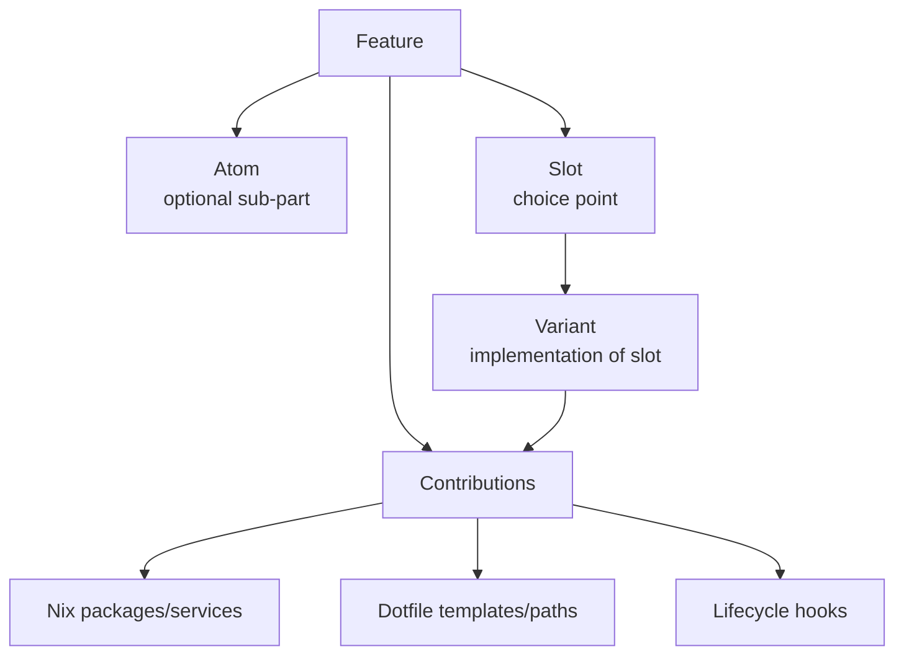
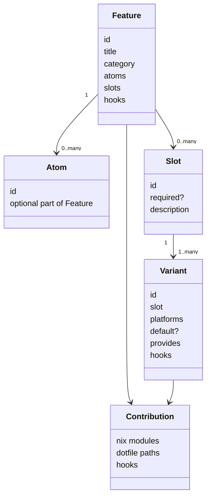
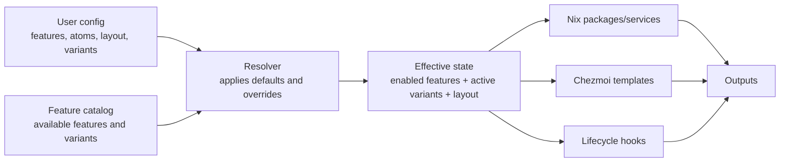
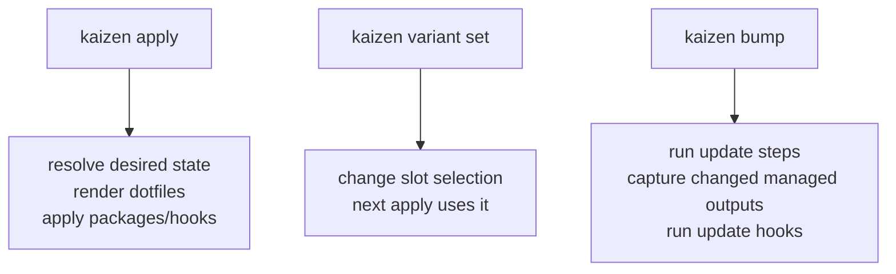
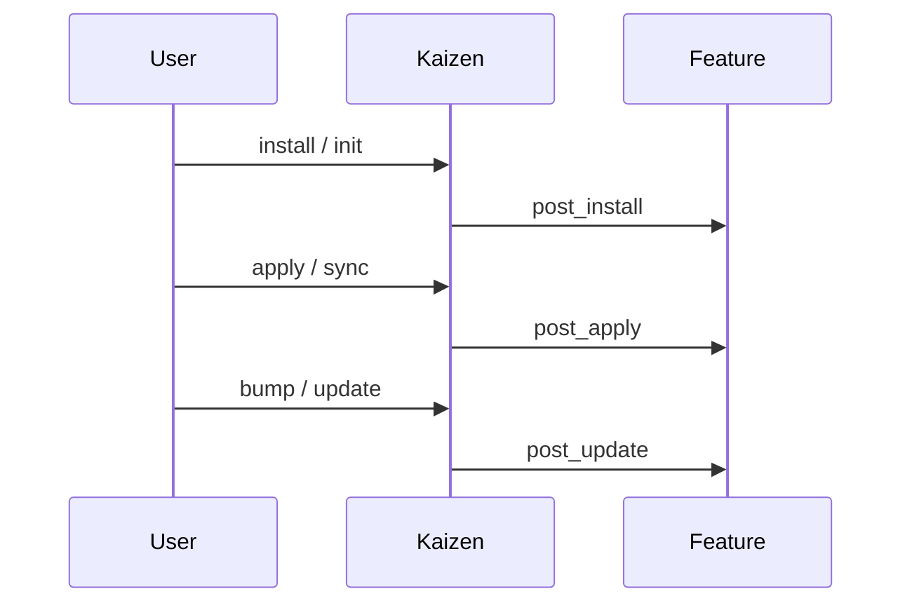
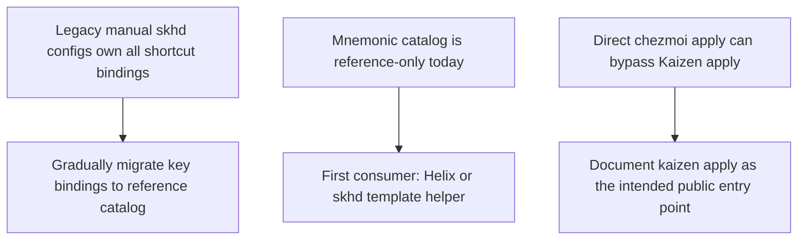

> [!WARNING]
> DEPRECATED: This document predates the keybindings.toml rename.
> References to `mnemonics.toml` and `[kaizen.mnemonics.shortcuts]` are outdated.
> See `docs/architecture.md` for the current architecture.

# Kaizen public architecture map

This page is for a contributor who opens Kaizen for the first time. It describes the **public authoring model**: what a feature author can declare, how Kaizen combines declarations, and where shortcuts fit.

Diagram rule used here: **one diagram answers one question**. No mega-diagrams.

## 0. Mental model

Kaizen has three public layers:



In plain words:

1. Feature authors declare what exists.
2. Users choose what they want.
3. Kaizen resolves choices into final packages, dotfiles, and hooks.
   Shortcuts stay in each application's own config.

---

## 1. Feature structure

A feature is the public unit of capability. It may contain atoms, slots, variants, hooks, packages, and dotfiles.



### Example: feature with a slot

```toml
# features/tiling/feature.toml

title = "Tiling window manager"

[[slots]]
id = "wm"
required = true
description = "Window manager implementation"
```

### Example: variant implementing that slot

```toml
# features/tiling/variants/komorebi/variant.toml

id = "komorebi"
slot = "tiling.wm"
title = "komorebi-for-mac"
platforms = ["darwin"]
default = false

[provides]
nix_modules = ["module.darwin.nix"]
dotfile_paths = ["dot_config/komorebi/", "dot_config/skhd/skhdrc-komorebi"]

[hooks]
post_apply = ["komorebic start --bar || true"]
```

### What this means

- `tiling` is a feature.
- `tiling.wm` is a slot owned by `tiling`.
- `komorebi` is one possible implementation of `tiling.wm`.
- The active variant contributes packages, dotfiles, and hooks.

---

## 2. Feature entities



### Public contracts

| Entity       | Public contract                                                                 |
| ------------ | ------------------------------------------------------------------------------- |
| Feature      | Capability a user can enable or disable.                                        |
| Atom         | Optional sub-capability a user can disable without disabling the whole feature. |
| Slot         | Named choice point inside a feature.                                            |
| Variant      | One implementation of a slot. Only one variant is active per slot.              |
| Contribution | Something a feature or variant adds to the final system.                        |
| Hook         | Command attached to a lifecycle phase.                                          |

---

## 3. How modules are assembled



### What gets resolved

```text
User says:       tiling enabled, layout = colemak
Feature says:    tiling has slot wm
Variants say:    wm can be yabai, komorebi, aerospace
Resolver says:   active variant is tiling.wm = komorebi
Outputs use:     enabled features + active variants + layout
```

---

## 4. Shortcuts: mnemonic catalog

Kaizen does **not** own application keybinding systems. Each application keeps its
prefix/leader, native syntax, and command binding.

The shared layer is a small **mnemonic catalog** in `dotfiles/kaizen/mnemonics.toml`.

Current accepted entries (first batch):

```toml
[shortcuts]
"projects.pick"    = "p p"
"pane.split.right" = "w v"
"pane.split.down"  = "w s"
"vcs.ui"           = "g g"
```

Deferred: `window.focus.*` (nav.\* keys accepted via layout overlay; no WM consumer yet), `files.find`, `vcs.status/diff/log`.
See `plans/mnemonic-shortcuts-plan.md` for the deferred list and blockers.

### Chezmoi template access

During `kaizen apply` / `kaizen sync`, the catalog is exported into
`.chezmoidata.toml` under `[kaizen.mnemonics.shortcuts]`:

```toml
[kaizen.mnemonics.shortcuts]
"projects.pick"    = "p p"
"pane.split.right" = "w v"
"pane.split.down"  = "w s"
"vcs.ui"           = "g g"
```

Chezmoi templates can then read any entry:

```gotemplate
{{ index .kaizen.mnemonics.shortcuts "projects.pick" }}
```

### Design principle

```text
Action id -> mnemonic path
```

Kaizen defines the vocabulary. Applications own the implementation and the
surface encoding. For example, `projects.pick = "p p"` can become `SPACE p p`
in an editor, `pp` in Xonsh, or an app-native binding in Emacs.

### What Kaizen does not do

- No shortcut rendering or generation.
- No host adapters (skhd/aerospace/niri).
- No command registry.
- No prefix/leader registry.
- No migration of every application shortcut.

See `plans/mnemonic-shortcuts-plan.md` for the full rationale.

---

## 5. Command behavior



### Public command expectations

| Command              | Public behavior                                                     |
| -------------------- | ------------------------------------------------------------------- |
| `kaizen apply`       | Main entry point. Applies desired state and renders dotfiles.       |
| `kaizen variant set` | Changes which variant implements a slot.                            |
| `kaizen bump`        | Runs configured update steps and re-captures changed managed files. |

---

## 6. Hook phases



Hook phase is part of the public API. Putting a hook in the wrong phase is a feature-authoring bug.

---

## 7. Open seams



These seams are intentionally visible because they are **not stable API yet**.
